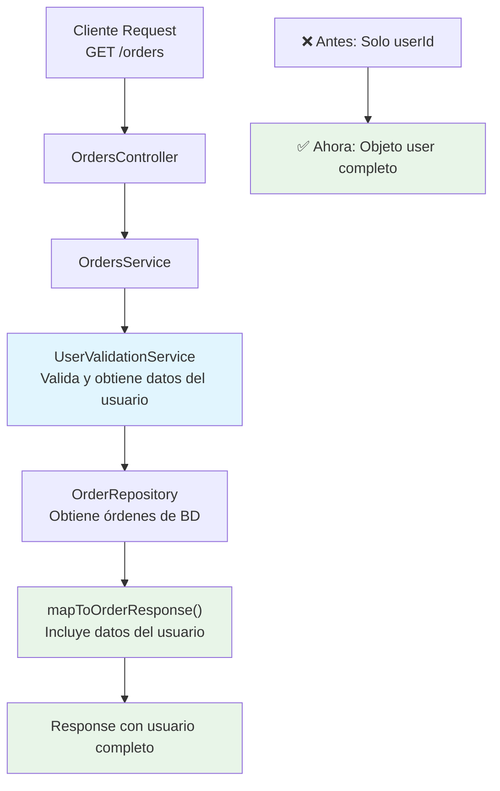

# 📝 Changelog

Historial de cambios y mejoras del sistema de microservicios.

## [1.1.0] - 2024-06-13

### ✨ Nuevas Características

#### 🔄 Mejora en Respuestas de Órdenes
- **Información completa del usuario**: Las respuestas de órdenes ahora incluyen los datos completos del usuario (nombre, email, rol) en lugar de solo el `userId`
- **Optimización de consultas**: Eliminada la necesidad de hacer consultas adicionales para obtener información del usuario desde el frontend

#### 📋 Cambios en API

**Endpoints afectados:**
- `GET /orders` - Lista órdenes del usuario
- `POST /orders` - Crear nueva orden  
- `PATCH /orders/:id` - Actualizar estado de orden
- `GET /orders/admin/all` - Lista todas las órdenes (admin)

**Estructura anterior:**
```json
{
  "id": "order-uuid-123",
  "userId": "user-uuid-123",
  "status": "PENDING",
  "totalAmount": 59.98,
  "orderItems": [...],
  "createdAt": "2024-01-01T00:00:00.000Z",
  "updatedAt": "2024-01-01T00:00:00.000Z"
}
```

**Estructura actual:**
```json
{
  "id": "order-uuid-123",
  "user": {
    "id": "user-uuid-123",
    "name": "María García",
    "email": "maria@example.com",
    "role": "USER"
  },
  "status": "PENDING",
  "totalAmount": 59.98,
  "orderItems": [...],
  "createdAt": "2024-01-01T00:00:00.000Z",
  "updatedAt": "2024-01-01T00:00:00.000Z"
}
```

#### 🏗️ Arquitectura



### 🔧 Cambios Técnicos

#### Order Service
- **DTO actualizado**: `OrderResponseDto` ahora incluye `UserResponseDto` en lugar de `userId`
- **Servicio mejorado**: `OrdersService.mapToOrderResponse()` optimizado para incluir datos del usuario
- **Validación**: Aprovecha la validación existente de usuarios via RabbitMQ para obtener datos completos
- **Tests**: Todas las pruebas unitarias actualizadas para reflejar la nueva estructura

#### Archivos modificados:
- `src/orders/dto/order-response.dto.ts`
- `src/orders/orders.service.ts`  
- `src/orders/orders.service.spec.ts`

### 🚀 Beneficios

1. **Mejor rendimiento del frontend**
   - Elimina consultas adicionales para obtener datos del usuario
   - Reduce la cantidad de requests HTTP necesarios

2. **Mejor experiencia de usuario**
   - Información del usuario disponible inmediatamente
   - No hay delays por cargas adicionales de datos

3. **Código más limpio**
   - Elimina lógica duplicada en el frontend
   - Consistencia en las respuestas de la API

4. **Optimización de red**
   - Menos tráfico de red entre servicios
   - Respuestas más completas en una sola petición

### 🔄 Migración

#### Para desarrolladores frontend:
```javascript
// Antes
const order = response.data;
const userId = order.userId;
// Necesitabas hacer otra petición para obtener datos del usuario

// Ahora
const order = response.data;
const user = order.user; // { id, name, email, role }
const userName = user.name;
const userEmail = user.email;
```

#### Compatibilidad
- ⚠️ **Breaking Change**: El campo `userId` ha sido reemplazado por el objeto `user`
- 📱 **Frontend**: Actualizar código que use `order.userId` para usar `order.user.id`
- 🧪 **Tests**: Actualizar expectativas en tests que verifiquen la estructura de respuesta

### 📚 Documentación actualizada
- [API.md](./API.md) - Ejemplos de respuesta actualizados
- [README.md](../README.md) - Información general actualizada

---

## [1.0.0] - 2024-06-01

### ✨ Lanzamiento inicial
- Microservicio de usuarios con autenticación JWT
- Microservicio de órdenes con gestión de estados
- Comunicación entre servicios via RabbitMQ
- Base de datos PostgreSQL con Prisma ORM
- Documentación completa con Swagger
- Docker containers para todos los servicios
- Tests unitarios y de integración

---

**Leyenda:**
- ✨ Nuevas características
- 🔧 Cambios técnicos
- 🐛 Corrección de errores
- 📚 Documentación
- ⚠️ Breaking changes
- 🚀 Mejoras de rendimiento 